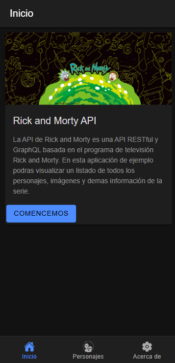
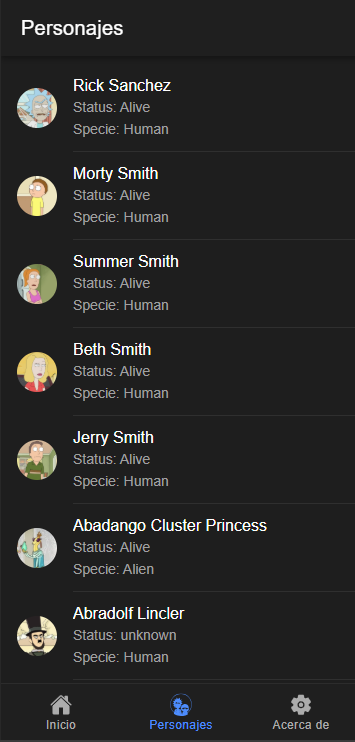
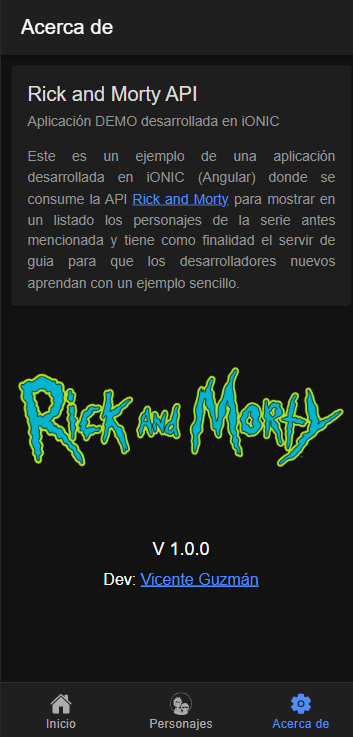

# RickNMorty App iONIC
 
Este es un ejemplo de una aplicación desarrollada en iONIC (Angular) donde se consume la API [rickandmortyapi.com/api/](https://rickandmortyapi.com/api/character) para mostrar en un listado los personajes de la serie antes mencionada y tiene como finalidad el servir de guia para que los desarrolladores nuevos aprendan con un ejemplo sencillo.

## ScreenShots

